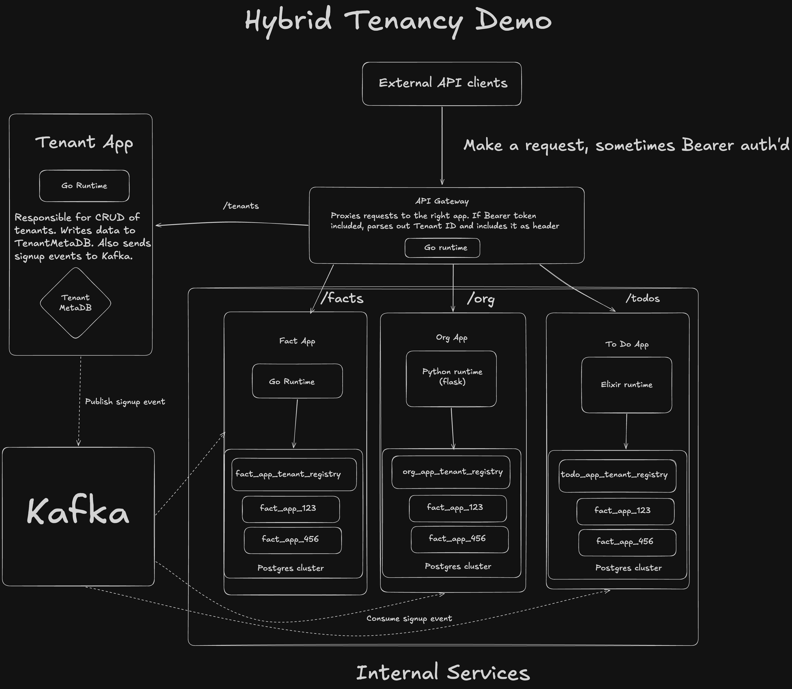

# Architecture diagram

## High-level flow

1. **Signup**: Client calls tenant-app `POST /tenants` → tenant-app writes to TenantMetaDB, mints JWT, publishes to Kafka.
2. **Event-driven provisioning**: fact-app, org-app, and todo-app consume `tenant.signups`; when their service is in the payload, they create a tenant DB (`<app>_<tenant_id>`) and register it in their TenantDB.
3. **API traffic**: Client calls api-gateway with `Authorization: Bearer <token>`; gateway validates JWT, sets `X-Tenant-ID`, and proxies to the appropriate app. Each app uses its TenantDB to resolve the tenant’s logical DB on the shared PostgreSQL cluster.
